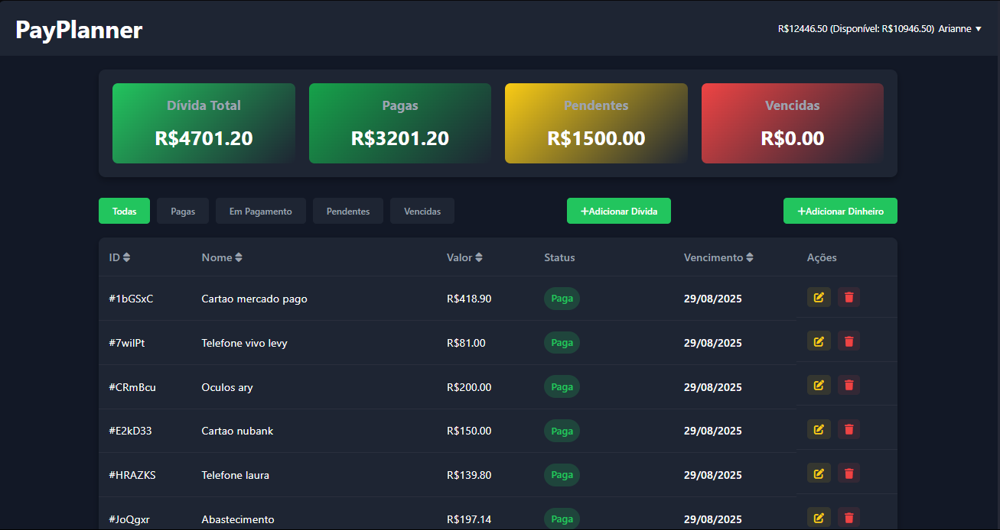

<!-- Banner -->

# PayPlanner

**PayPlanner** is a modern web application for **personal finance and debt management**,  
developed with **Firebase** for authentication and data storage.

**Access here:** [PayPlanner Online](https://pay-planner.vercel.app/)

---

## Badges

  

---

## Features

- **User Authentication**: secure login with Firebase Auth.  
- **Financial Dashboard**: overview of key financial metrics.  
- **Debt Management**:  
  - Add new debts  
  - Edit or delete debts  
  - Filter debts by status: `Paid`, `In Payment`, `Pending`, `Overdue`  
- **Financial Summary**:  
  - Total debts  
  - Paid amount  
  - Pending amount  
  - Overdue amount  
- **Responsive Design**: fully functional on desktop and mobile devices.  

---

## Technologies Used

  

- **HTML5**  
- **CSS3** (responsive design, variables for theme customization)  
- **JavaScript (ES6+)**  
- **Firebase** (Authentication & Firestore)  
- **Hosting** (GitHub Pages / Vercel)  

---

## Preview

  <h3>Login</h3>
  

  <h3>Dashboard</h3>
  

---

## Project Status

**In development** – new features will be added soon.

---

## Author

Made by **[Levy Abreu](https://github.com/LevyAbreu)**

<!-- Footer -->

